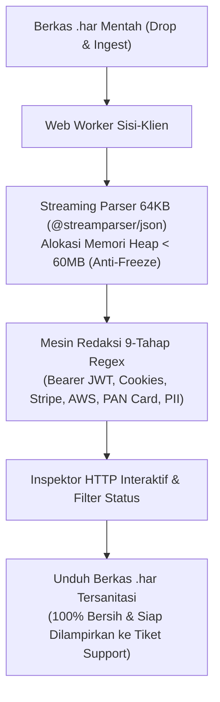

# SafeHAR: 100% In-Browser HTTP Archive (.har) Sanitizer

[](https://github.com/nantalira/safehar/actions/workflows/ci.yml)
[](./LICENSE)
[](https://bun.sh)
[](https://astro.build)

Utilitas privasi dan pembersih berkas **HTTP Archive (.har)** 100% di sisi klien (*in-browser*). SafeHAR menyamarkan kredensial otentikasi, kuki sesi, API keys, email, dan kartu pembayaran sensitif sebelum berkas log jaringan dikirimkan ke pihak ketiga (seperti Zendesk, Salesforce, AWS Support, atau Atlassian).



---

## 🔒 Jaminan Privasi & Performa

1. **100% Client-Side Processing (Zero-Server Ingestion):** Berkas diproses sepenuhnya di peramban pengguna menggunakan Web Streams API dan Web Worker. Tidak ada bita data yang pernah ditransmisikan ke server eksternal mana pun (dilindungi oleh Content Security Policy yang ketat).
2. **Anti-Freeze Heap Memory < 60MB:** Membedah berkas log jaringan raksasa (hingga 500MB+) tanpa membebani memori utama peramban atau membuat browser macet melalui penguraian inkremental berbasis chunk 64KB.
3. **Katalog Redaksi 9-Tahap Berurutan:**
   - **Stage 1: Bearer JWT Tokens** (`Bearer ey...` $\rightarrow$ `Bearer [REDACTED_JWT_TOKEN]`)
   - **Stage 2: Basic Auth Credentials** (`Basic ...` $\rightarrow$ `Basic [REDACTED_BASIC_AUTH]`)
   - **Stage 3: Session Cookies** (`PHPSESSID`, `JSESSIONID`, `connect.sid`, `ASP.NET_SessionId`)
   - **Stage 4: OAuth Access & Refresh Tokens**
   - **Stage 5: Stripe Secret & Restricted Keys** (`sk_live_...`, `rk_live_...`)
   - **Stage 6: AWS Access Keys** (`AKIA...`, `ASIA...`)
   - **Stage 7: GitHub Personal Access Tokens** (`ghp_...`, `gho_...`, `ghu_...`)
   - **Stage 8: Alamat Email / PII**
   - **Stage 9: Kartu Pembayaran** (Format Luhn PAN 13–16 digit)

---

## 📦 Struktur Repositori (Monorepo)

| Path | Paket | Deskripsi |
| :--- | :--- | :--- |
| [`packages/contracts`](./packages/contracts) | `@safehar/contracts` | Kontrak tipe data TypeScript & katalog panduan keamanan vendor. |
| [`packages/safehar-core`](./packages/safehar-core) | `@safehar/core` | Streaming parser 64KB (`@streamparser/json`), mesin sanitasi 9-tahap, dan Web Worker. |
| [`apps/web`](./apps/web) | `@safehar/web` | Frontend web Astro (SSG) + Tailwind CSS v4 + 12 Halaman SEO Panduan Vendor. |
| [`apps/safehar-extension`](./apps/safehar-extension) | `@safehar/extension` | Ekstensi peramban Chrome Manifest V3 (*Zero Host Permissions*, izin tunggal `"storage"`). |

---

## 🚀 Panduan Memulai Cepat

### Prasyarat
- [Bun](https://bun.sh) (v1.3.0 atau lebih baru)

### 1. Instalasi Dependensi
```bash
bun install
```

### 2. Menjalankan Pengujian Otomatis
```bash
bun run test
```

### 3. Kompilasi Seluruh Monorepo
```bash
bun run build
```

### 4. Menjalankan Web Apps di Lingkungan Lokal
```bash
bun --cwd apps/web run dev
# Buka http://localhost:4321
```

### 5. Memasang Ekstensi Chrome (Local Development)
1. Buka `chrome://extensions/` di Google Chrome.
2. Aktifkan **Developer mode** di pojok kanan atas.
3. Klik **Load unpacked** (*Muat yang belum dibongkar*).
4. Pilih folder: `./apps/safehar-extension` dari repositori ini.

---

## ☁️ Panduan Self-Hosting ke Cloudflare Pages (Gratis)

Anda dapat men-deploy instance SafeHAR Anda sendiri ke Cloudflare Pages secara gratis dalam 2 menit:

1. Buat proyek baru di [Cloudflare Dashboard](https://dash.cloudflare.com/) $\rightarrow$ **Workers & Pages** $\rightarrow$ **Create Application** $\rightarrow$ **Pages** $\rightarrow$ **Connect to Git**.
2. Pilih repositori GitHub Anda.
3. Atur konfigurasi build:
   - **Framework preset:** `None` atau `Astro`
   - **Build command:** `bun run --cwd apps/web build`
   - **Build output directory:** `apps/web/dist`
   - **Environment variable:** `BUN_VERSION=1.3.14`
4. Klik **Save and Deploy**. Seluruh 13 rute halaman statis akan langsung aktif di domain `*.pages.dev`!

---

## 📄 Lisensi

Proyek ini dilisensikan di bawah [MIT License](./LICENSE).
